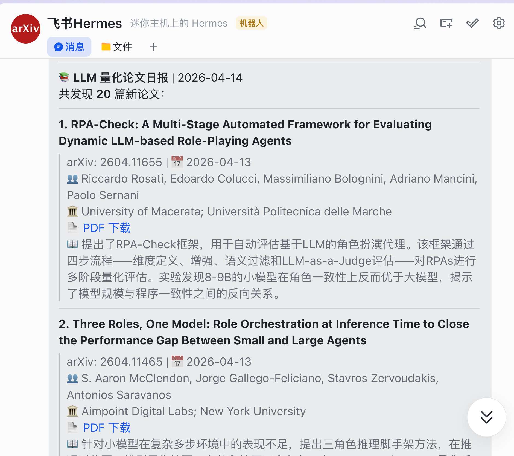
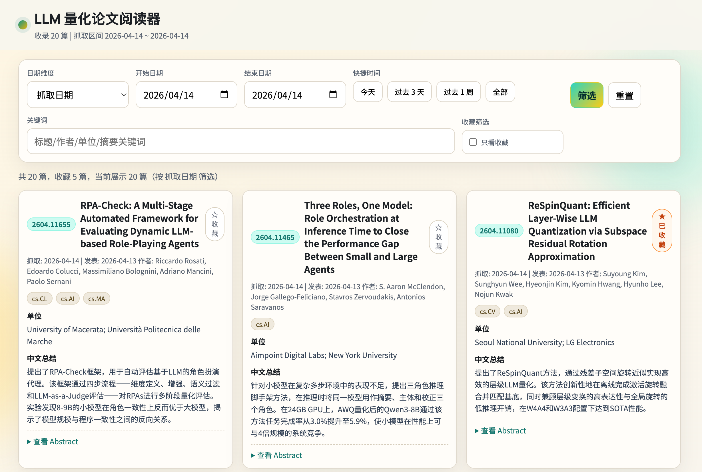

# 我做了一个基于 Hermes 的 agent skill：每天自动追踪 arXiv 论文、生成中文摘要、推送飞书，还带一个本地阅读网站

最近我一直在折腾一件很具体的小事：

怎么把“每天追踪 arXiv 上的新论文”这件事，做成一个真正可以长期稳定运行、而且几乎不需要人工维护的系统。

我的目标不是单纯写一个爬虫，也不是只做一个摘要脚本，而是把整条链路串起来：

- 每天自动搜索指定方向的新论文
- 自动下载 PDF
- 自动生成中文摘要
- 自动补全作者单位
- 自动推送到飞书
- 自动沉淀到本地数据表
- 自动同步到一个本地静态阅读网站

最后，我把它做成了一个基于 **Hermes** 的 **agent skill**：

项目名叫 **hermes-portfolio-sentinel**。

一句话概括就是：

**这是一个基于 Hermes 的 agent skill，可以每天自动从 arXiv 抓取论文，用 AI 生成中文摘要和作者单位，推送到飞书，并提供一个本地静态阅读网站。**

---

## 最让我满意的一点：一句话安装

我觉得这个项目最有意思的地方，不是“它能抓论文”，而是它已经不是传统意义上的“脚本项目”了。

它的理想使用方式，不是让用户：

1. 自己 clone 仓库
2. 自己安装依赖
3. 自己修改路径
4. 自己写 cron
5. 自己配置推送目标

而是直接在 **Hermes 对话里说一句话**：

```text
请从该地址 https://github.com/genggng/hermes-portfolio-sentinel/blob/main/AGENT_SKILL.md 安装 skill 并执行。
```

然后 Hermes 会自己完成：

- 克隆仓库
- 安装 Python 依赖
- 生成定时任务 prompt
- 创建 cron job
- 把定时任务的投递目标设为 Feishu

这也是我为什么一直强调它是一个 **Hermes skill**，而不只是一个 Python 仓库。

最近 Hermes 本身也越来越火，大家已经不满足于“写个 agent demo”了，而是开始在意：

- 能不能长期运行
- 能不能和真实消息渠道打通
- 能不能把部署复杂度降下来
- 能不能从一次性脚本变成稳定的 agent workflow

这个项目本质上就是在往这个方向走。

---

## 我为什么要做这个项目

做这个项目的直接原因很简单：

我平时会关注 LLM 量化相关论文，但每天去刷 arXiv 很低效。

真正烦人的不是“看论文”本身，而是下面这些重复劳动：

- 每天去搜关键词
- 判断哪些是新增
- 下载 PDF
- 粗读 abstract
- 识别作者单位
- 整理成适合分享的内容
- 再发到飞书或者做内部同步

如果只是偶尔做一次，这些步骤不算什么。

但只要变成“每天都做”，它就很值得自动化。

于是我开始搭这个系统，并且在过程中越来越明确：  
这件事应该让 **Hermes agent** 来接管，而不是停留在“脚本 + 手工补全”的阶段。

---

## 这个项目具体做了什么

整个系统大概分成三层。

### 1. 数据抓取层

每天定时执行 `monitor.py`，它会完成这些事情：

- 读取 `search_keywords.txt`
- 调用 arXiv API 搜索最新论文
- 做去重判断
- 下载新论文 PDF
- 更新 `papers_record.xlsx`
- 生成给 Hermes 使用的中间文件 `new_papers.json`

这里的默认监控方向是：

- **LLM 量化相关论文**

如果你想改成别的方向，只需要改 `search_keywords.txt`。

这点我也专门写进了 skill，让 agent 在部署时就知道它默认监控的是量化方向。

### 2. Agent 补全层

这是我觉得最关键的一层。

单纯靠爬取拿到的只是：

- 论文标题
- 作者
- 英文摘要
- 分类
- PDF 地址

但真正适合每天阅读和推送的内容，还缺两样很重要的东西：

- 作者单位
- 高质量中文摘要

这部分我没有硬编码成普通规则脚本，而是交给 Hermes / LLM 去完成。

它会读取 PDF 前两页，尝试提取作者单位；然后基于英文 abstract 生成一段 90-150 字的中文总结。

而且这个系统已经不再把“是否抓取过”和“是否完成 agent 补全”混为一谈了。

我后来专门把这层状态拆开，增加了一个独立的待处理队列：

- `crawled_ids.txt`：表示论文已经抓取过
- `pending_llm_ids.txt`：表示论文还没完成 agent 补全

这样就避免了一个常见问题：

有时 Python 第一段已经下载了论文，但第二段 agent 总结还没跑完。  
如果只看“是否抓取过”，后续定时任务就会把这篇论文错过。

现在不会了。

只要一篇论文还没补全 `affiliations` 和 `summary_cn`，它就会继续留在待处理队列里，直到真正完成为止。

### 3. 展示与分发层

当论文补全结束后，系统会继续完成两个动作：

- 生成飞书日报
- 重建本地阅读网站的数据文件 `viewer/papers_data.json`

这样一来，数据不会只停留在 Excel 里，而是会自动同步到前端阅读页。

---

## 现在实际长什么样

### 飞书推送效果



它每天会把新论文整理成一份结构化日报，里面包括：

- 标题
- arXiv ID
- 日期
- 作者
- 单位
- PDF 链接
- 中文摘要

这个形式非常适合每天快速浏览，不需要再点开每篇论文自己手工整理。

### 本地阅读网站效果



我还做了一个很轻量的本地静态阅读网站。

它不复杂，但很实用，支持：

- 按抓取日期或发表日期筛选
- 按关键词全文检索
- 查看中文摘要
- 查看作者单位
- 收藏论文

对于“先浏览一遍，再决定哪些要精读”这个场景，这种页面比直接翻 Excel 更舒服很多。

---

## 技术上我重点解决了哪些问题

这个项目真正花时间的，不是“抓取 arXiv”本身，而是把它做成一个 **稳定运行的 agent workflow**。

我主要处理了下面几个问题。

### 1. 路径问题

一开始这个项目最大的问题之一，就是很多路径是写死的：

- 定时任务 prompt 里写了绝对路径
- 代码里也有本地绝对路径

这会导致项目很难迁移。

后来我把代码里的项目路径都改成了相对路径自定位，也把 cron prompt 分成了两层：

- `cronjob_prompt.txt`：模板文件
- `cronjob_prompt.generated.txt`：部署时由脚本生成的最终 prompt

这样模板仓库就不会被某台机器的本地路径污染。

### 2. 运行产物和模板仓库分离

我不希望远端仓库里混着各种运行产物，所以又专门做了一轮清理。

现在这些文件都不会再提交到远端：

- `viewer/papers_data.json`
- `viewer/favorites.json`
- `new_papers.json`
- `pending_llm_ids.txt`
- `cronjob_prompt.generated.txt`
- Excel 记录文件

模板仓库只保留应该被版本控制的部分。

### 3. 定时任务投递目标

如果 cron delivery 配错了，任务虽然会执行，但消息可能只会留在本地，不会发到飞书。

所以我在 skill 里明确要求：

- 这个项目的 cron delivery 要设为 `feishu`
- 不能停留在 `local`

这看起来像小事，但其实非常关键。  
否则“自动化”只完成了一半。

### 4. 网站数据不同步

我实际部署时还遇到过一个问题：

第一阶段抓取完成后，`papers_data.json` 会先生成一版，但那时作者单位和中文摘要还是空的。  
如果后续 agent 回填 Excel 后不再重新导出，网站里看到的就一直是“粗提取版本”。

所以我把流程补齐了：

- 回填 Excel
- 重建 `viewer/papers_data.json`
- 再发送飞书消息

这样飞书、Excel、网站三处数据是一致的。

### 5. “已抓取”不等于“已完成”

这一点我前面提过，但它值得单独强调。

很多自动化流程最大的问题，不是不会执行，而是状态设计得太粗。

如果只用一个 `crawled_ids.txt` 表示“处理过”，那一旦 agent 中途失败，系统就会误以为这篇论文已经完成了。

我后来专门把“已抓取”和“待 LLM 补全”分开，整个流程就稳了很多。

---

## 为什么我觉得 Hermes 很适合做这类项目

我做完这个项目之后，最大的感受其实不是“LLM 能总结论文”，而是：

**Hermes 非常适合承接这种长期运行、跨多步骤、带真实外部投递的 agent 任务。**

因为这类任务本身就很符合 agent 的优势：

- 有明确目标
- 有固定流程
- 需要工具调用
- 需要消息投递
- 需要定时运行
- 需要状态延续

如果没有 Hermes，这个项目当然也能做，但很容易退化成：

- 一堆脚本
- 一堆路径配置
- 一堆手工部署说明
- 一堆人肉操作

而有了 Hermes skill 之后，它的形态就完全不一样了：

你不是在“部署一个脚本仓库”，而是在“安装一个可执行的 agent workflow”。

这也是我觉得这个项目最有意思的地方。

---

## 适合哪些人用

我觉得这个项目比较适合下面几类人：

- 需要长期跟踪某个 arXiv 方向的研究者
- 想把论文监控接到飞书群或个人会话的人
- 想做一个自己的“论文情报流”系统的人
- 对 Hermes skill / agent workflow 感兴趣的人

虽然我默认配置的是 **LLM 量化**，但它其实不局限于量化。

只要改一下 `search_keywords.txt`，就能切到别的主题，比如：

- 多模态
- Agent
- 推理模型
- RAG
- AI Infra

---

## 如果你也想试一下

最简单的方式还是那句：

在 Hermes 对话里直接说：

```text
请从该地址 https://github.com/genggng/hermes-portfolio-sentinel/blob/main/AGENT_SKILL.md 安装 skill 并执行。
```

如果你的 Hermes 和 Feishu 已经打通，基本就能把整条链路跑起来。

---

## 最后

我越来越觉得，接下来很多个人自动化项目都会走向一个共同方向：

不是“写一个工具”，  
而是“做一个能被 agent 接管的 workflow”。

`hermes-portfolio-sentinel` 对我来说，就是这个方向上的一次比较完整的实践。

它不是一个巨大的系统，也不是一个炫技 demo。  
它只是把一件我真的每天会做、而且真的很烦的事情，交给 Hermes 持续稳定地做下去。

如果你也在折腾：

- 论文监控
- agent 自动化
- Hermes skill
- 飞书工作流

那这个项目也许会对你有点帮助。

项目地址：

- https://github.com/genggng/hermes-portfolio-sentinel
